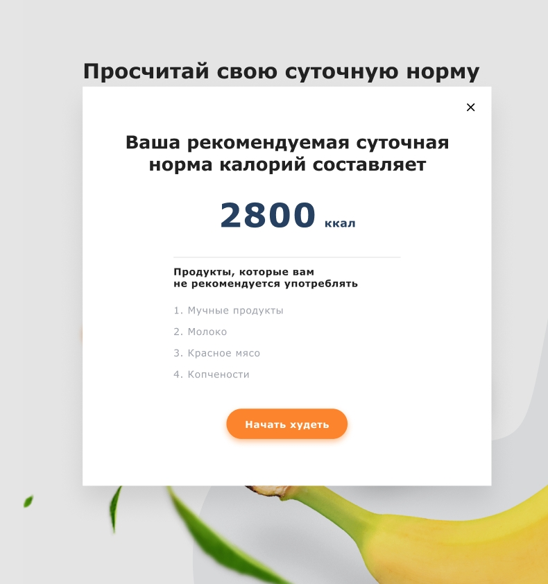
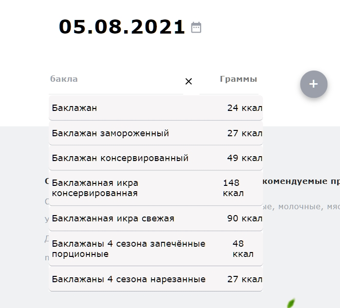
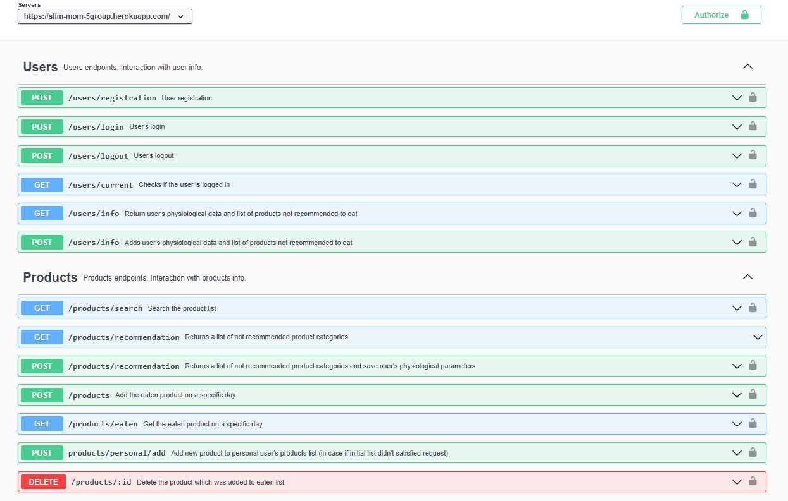

# Худей легко!

## Если хочешь похудеть, а держать в голове список съеденых продуктов не для тебя. Тогда быстрее регистрируйся в нашем приложении, и веди свой личный дневник похудения.

### Web Приложения [Slim Mom](https://slimmom5group.netlify.app/) предоставляет тебе возможность бесплатно хранить данные на сервере, иметь к ним доступ, и наглядно вести учет уподребленных продуктов за день.

##

## Описание

##

При первом знакомстве с приложением, необходимо заполнить короткую форму, для корректной обработки данных именно под тебя).
При успешной регистрации в личном дневнике: будет всегда выведена информация про список продуктов, от которых стоит воздержаться, и рекомендуемое количесто килокалорий в день.

Приложение предоставляет возможность подключится с любого удобного устройства: телефон, планшет, компьютер.
Ежедневно ты сможешь добавлять и удалять в список продукты и их количесто, употребленных за день. И даже если ты что-то забыл добавить, это легко поправить. Прочто выбери необходимый дент в календаре и добавь продукт.

Приложения будет доступно после авторизации пользователя !

## Фронт-часть приложения [Slim Mom](https://github.com/Anastasia-spl/slim-mom-frontend):

## Бэк-часть приложения [Slim Mom](https://github.com/Anastasia-spl/slim-mom-backend):

## Чтоб просметрить весть список путей, которые использываются в реализации этого приложения, расписаны с помощью [swagger](https://swagger.io/), и полное руководство описано на [slimmpm_api_docs](https://slim-mom-5group.herokuapp.com/api-docs/)

